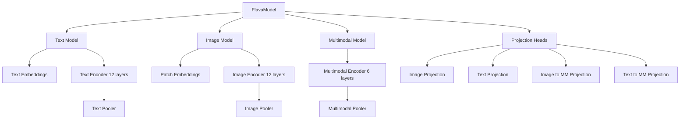

# Flava: [Flava](https://huggingface.co/facebook/flava-full)

## Summary

Flava is a multimodal transformer model designed to handle both vision and language tasks, as well as their combination. It is trained on large-scale image, text, and image-text data, enabling it to perform a wide range of tasks including image classification, text classification, image-text retrieval, and multimodal reasoning. Flava features separate unimodal encoders for images and text, as well as a multimodal encoder for joint understanding, allowing flexible and effective learning across modalities. The model demonstrates strong performance on both unimodal and multimodal benchmarks, highlighting its versatility and generalization ability.

## Example

```python
from PIL import Image
import requests

from transformers import FlavaProcessor, FlavaModel

model = FlavaModel.from_pretrained("facebook/flava-full")
processor = FlavaProcessor.from_pretrained("facebook/flava-full")

url = "http://images.cocodataset.org/val2017/000000039769.jpg"
image = Image.open(requests.get(url, stream=True).raw)

inputs = processor(
  text=["a photo of a cat", "a photo of a dog"], images=[image, image], return_tensors="pt", padding="max_length", max_length=77
)

outputs = model(**inputs)
image_embeddings = outputs.image_embeddings # Batch size X (Number of image patches + 1) x Hidden size => 2 X 197 X 768
text_embeddings = outputs.text_embeddings # Batch size X (Text sequence length + 1) X Hidden size => 2 X 77 X 768
multimodal_embeddings = outputs.multimodal_embeddings # Batch size X (Number of image patches + Text Sequence Length + 3) X Hidden size => 2 X 275 x 768
# Multimodal embeddings can be used for multimodal tasks such as VQA


## Pass only image
from transformers import FlavaFeatureExtractor

feature_extractor = FlavaFeatureExtractor.from_pretrained("facebook/flava-full")
inputs = feature_extractor(images=[image, image], return_tensors="pt")
outputs = model(**inputs)
image_embeddings = outputs.image_embeddings

## Pass only text
from transformers import BertTokenizer

tokenizer = BertTokenizer.from_pretrained("facebook/flava-full")
inputs = tokenizer(["a photo of a cat", "a photo of a dog"], return_tensors="pt", padding="max_length", max_length=77)
outputs = model(**inputs)
text_embeddings = outputs.text_embeddings
```

## FlavaModel Architecture (Graph Structure)



```model
FlavaModel(
  (text_model): FlavaTextModel(
    (embeddings): FlavaTextEmbeddings(
      (word_embeddings): Embedding(30522, 768, padding_idx=0)
      (position_embeddings): Embedding(512, 768)
      (token_type_embeddings): Embedding(2, 768)
      (LayerNorm): LayerNorm((768,), eps=1e-12, elementwise_affine=True)
      (dropout): Dropout(p=0.0, inplace=False)
    )
    (encoder): FlavaEncoder(
      (layer): ModuleList(
        (0-11): 12 x FlavaLayer(
          (attention): FlavaAttention(
            (attention): FlavaSelfAttention(
              (query): Linear(in_features=768, out_features=768, bias=True)
              (key): Linear(in_features=768, out_features=768, bias=True)
              (value): Linear(in_features=768, out_features=768, bias=True)
              (dropout): Dropout(p=0.0, inplace=False)
            )
            (output): FlavaSelfOutput(
              (dense): Linear(in_features=768, out_features=768, bias=True)
              (dropout): Dropout(p=0.0, inplace=False)
            )
          )
          (intermediate): FlavaIntermediate(
            (dense): Linear(in_features=768, out_features=3072, bias=True)
            (intermediate_act_fn): GELUActivation()
          )
          (output): FlavaOutput(
            (dense): Linear(in_features=3072, out_features=768, bias=True)
            (dropout): Dropout(p=0.0, inplace=False)
          )
          (layernorm_before): LayerNorm((768,), eps=1e-12, elementwise_affine=True)
          (layernorm_after): LayerNorm((768,), eps=1e-12, elementwise_affine=True)
        )
      )
    )
    (layernorm): LayerNorm((768,), eps=1e-12, elementwise_affine=True)
    (pooler): FlavaPooler(
      (dense): Linear(in_features=768, out_features=768, bias=True)
      (activation): Tanh()
    )
  )
  (image_model): FlavaImageModel(
    (embeddings): FlavaImageEmbeddings(
      (patch_embeddings): PatchEmbeddings(
        (projection): Conv2d(3, 768, kernel_size=(16, 16), stride=(16, 16))
      )
      (dropout): Dropout(p=0.0, inplace=False)
    )
    (encoder): FlavaEncoder(
      (layer): ModuleList(
        (0-11): 12 x FlavaLayer(
          (attention): FlavaAttention(
            (attention): FlavaSelfAttention(
              (query): Linear(in_features=768, out_features=768, bias=True)
              (key): Linear(in_features=768, out_features=768, bias=True)
              (value): Linear(in_features=768, out_features=768, bias=True)
              (dropout): Dropout(p=0.0, inplace=False)
            )
            (output): FlavaSelfOutput(
              (dense): Linear(in_features=768, out_features=768, bias=True)
              (dropout): Dropout(p=0.0, inplace=False)
            )
          )
          (intermediate): FlavaIntermediate(
            (dense): Linear(in_features=768, out_features=3072, bias=True)
            (intermediate_act_fn): GELUActivation()
          )
          (output): FlavaOutput(
            (dense): Linear(in_features=3072, out_features=768, bias=True)
            (dropout): Dropout(p=0.0, inplace=False)
          )
          (layernorm_before): LayerNorm((768,), eps=1e-12, elementwise_affine=True)
          (layernorm_after): LayerNorm((768,), eps=1e-12, elementwise_affine=True)
        )
      )
    )
    (layernorm): LayerNorm((768,), eps=1e-12, elementwise_affine=True)
    (pooler): FlavaPooler(
      (dense): Linear(in_features=768, out_features=768, bias=True)
      (activation): Tanh()
    )
  )
  (multimodal_model): FlavaMultimodalModel(
    (encoder): FlavaEncoder(
      (layer): ModuleList(
        (0-5): 6 x FlavaLayer(
          (attention): FlavaAttention(
            (attention): FlavaSelfAttention(
              (query): Linear(in_features=768, out_features=768, bias=True)
              (key): Linear(in_features=768, out_features=768, bias=True)
              (value): Linear(in_features=768, out_features=768, bias=True)
              (dropout): Dropout(p=0.0, inplace=False)
            )
            (output): FlavaSelfOutput(
              (dense): Linear(in_features=768, out_features=768, bias=True)
              (dropout): Dropout(p=0.0, inplace=False)
            )
          )
          (intermediate): FlavaIntermediate(
            (dense): Linear(in_features=768, out_features=3072, bias=True)
            (intermediate_act_fn): GELUActivation()
          )
          (output): FlavaOutput(
            (dense): Linear(in_features=3072, out_features=768, bias=True)
            (dropout): Dropout(p=0.0, inplace=False)
          )
          (layernorm_before): LayerNorm((768,), eps=1e-12, elementwise_affine=True)
          (layernorm_after): LayerNorm((768,), eps=1e-12, elementwise_affine=True)
        )
      )
    )
    (layernorm): LayerNorm((768,), eps=1e-12, elementwise_affine=True)
    (pooler): FlavaPooler(
      (dense): Linear(in_features=768, out_features=768, bias=True)
      (activation): Tanh()
    )
  )
  (image_projection): Linear(in_features=768, out_features=768, bias=True)
  (text_projection): Linear(in_features=768, out_features=768, bias=True)
  (image_to_mm_projection): Linear(in_features=768, out_features=768, bias=True)
  (text_to_mm_projection): Linear(in_features=768, out_features=768, bias=True)
)
```
