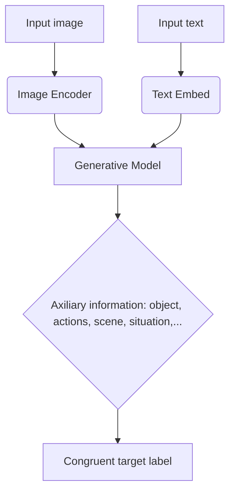
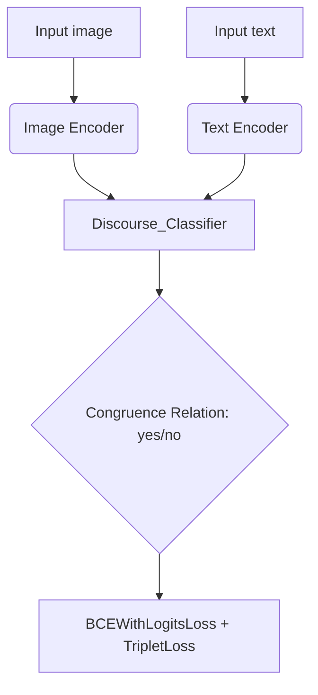
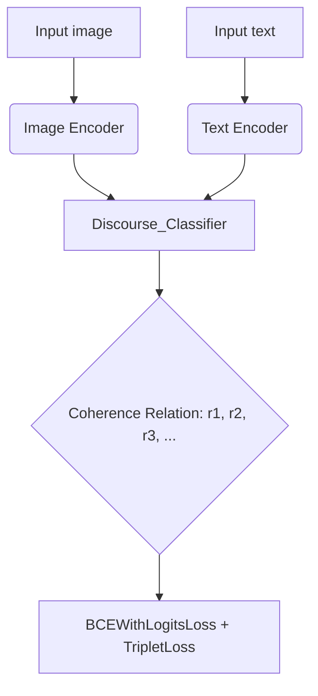
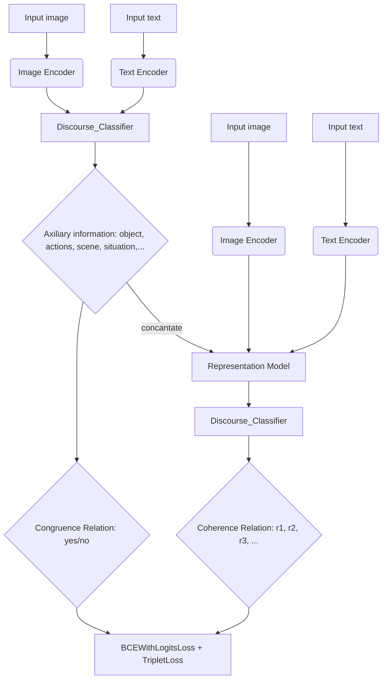

## One-stage model:

### Preprocessing 



> 1. Basic idea for this part is to classify congruence and incongruence by generating auxiliary informations.
> 2. Generative Model: used for generation of auxiliary informations
> 3. Prossible model reference:
>   1. [Pham et al.2024](https://openaccess.thecvf.com/content/CVPR2024/papers/Pham_Composing_Object_Relations_and_Attributes_for_Image-Text_Matching_CVPR_2024_paper.pdf)
>   2. [Cheng et al.2022](https://dl.acm.org/doi/10.1145/3499027)
>   3. [Wang et al. 2019](https://arxiv.org/pdf/1910.05134)
>   4. [Xu et al.2020](https://ieeexplore.ieee.org/document/8994196)


### Congruence classification


> This part is used for congruence relation classification. 


### Coherence classification


> This part is used for coherence relation classification. 


## Two-stage model:




```chart
- Complement:
1. Image_encoder:  Attention based model/ViT(alternative Resnet model) + Batch_norm + Fully Connection
2. Text_encoder: Sentence_encoder + Batch_norm + Fully Connection
3. Sentence_encoder: embed_layer + Bert(alternative LSTM ) [+ Attention_layer]
4. Attention_layer: hidden layer
5. Discourse_classifier: Fully Connection
6. CNN/Representation model(feature extraction)

```
